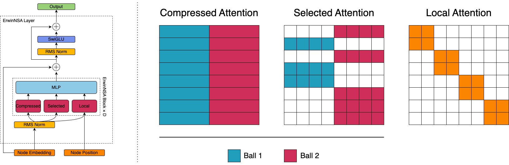

# Erwin + NSA
<p align="center">
    <strong>Natively Trainable Sparse Attention for Hierarchical Point Cloud Datasets</strong><br/>
    Nicolas Lapautre, Maria Marchenko, Carlos Miguel Patiño, Xin Zhou
    <br/>
    <br/>
    
</p>

## Introduction

This project tackles the quadratic complexity of self-attention in transformer models when applied to large-scale 3D point cloud data, a critical bottleneck for physical systems modeling. It builds upon [Erwin](https://arxiv.org/abs/2502.17019)," a hierarchical transformer using ball tree partitioning for sub-quadratic scaling. Our main contribution is the integration of [Native Sparse Attention](https://arxiv.org/abs/2502.11089) (NSA)—originally for long-context language models—into Erwin, creating "Erwin + NSA." This aims to boost efficiency and receptive field by adapting NSA's hardware-aligned sparse attention (compressed, selection, and a novel local ball attention) for non-sequential, hierarchical point clouds. We first validate our Erwin implementation by reproducing original results, and then benchmark Erwin + NSA against Erwin on cosmological, molecular dynamics, and airflow datasets, showing comparable or superior performance and speed.
 

## Using Erwin + NSA
Erwin expects as inputs:
 - `node_features`: a ragged array of node features, shape: [num_points, num_features]
 - `node_positions`: a ragged array of node positions, shape: [num_points, num_dimensions]
 - `batch_idx`: batch assignment for each node, shape: [num_points] (e.g. [0, 0, 1, 1, 1, 2, 2, ...])

```python
import torch
from models import NSABallformer

config = {
    "c_in": 64,
    "c_hidden": 64,
    "rotate": 45,
    "depth": 6,
    "num_heads": 16,
    "compress_ball_size": 32,
    "local_ball_size": 128,
    "num_selected_blocks": 16,
    "min_nsa_heads": 16,
    "num_layers": 1,
}

model = NSABallformer(**config).cuda()

bs = 16
num_points = 2048

node_features = torch.randn(num_points * bs, 32).cuda()
node_positions = torch.rand(num_points * bs, 3).cuda()
batch_idx = torch.repeat_interleave(torch.arange(bs), num_points).cuda()

out = model(node_features, node_positions, batch_idx)
```

### Dependencies


A virtual environment named `erwin` can be created using `uv`and activated with:
```
bash setup.sh
```

If you only want to play with Erwin and don't want to install additional dependencies (tensorflow, spconv, etc.) use
```
bash setup.sh --minimal
```

to install `uv` run:
```
curl -LsSf https://astral.sh/uv/install.sh | sh
```

Install the `native_sparse_attention` library following the instructions in Fla-Org's [NSA repository](https://github.com/fla-org/native-sparse-attention?tab=readme-ov-file#setup).


## Replicating experiments

We provide the code to run Erwin and Erwin + NSA on the `experiments` folder, where the `train_<dataset>.py` scripts are located. The code is based on the original Erwin implementation and can be run with the following command:

```
cd experiments
python train_md.py --use-wandb 1 --size medium --model erwin --data-path "path/to/data/dir"
```

### Experimental Data
To run/replicate experiments, you will need to download:
- [Cosmology dataset](https://zenodo.org/records/11479419) (7 GB)
- [Single-chain polymer dataset (MD)](https://zenodo.org/records/6764836) (13 GB) + [splits](https://github.com/kyonofx/mlcgmd/tree/main/graphwm/splits/chain)
- [ShapeNet-Car dataset](https://github.com/ml-jku/UPT/blob/main/SETUP_DATA.md) (2 GB) 

For the single-chain polymer dataset, download all files and move them to the data folder that contains the `splits` folder.

## Model Details

### Ball Tree
A **ball tree** is a hierarchical data structure that recursively partitions points into nested sets of similar size, where each set is represented by a ball that covers all the points in the set. The input is a point cloud, and the tree is built recursively as shown in this visualization from [Erwin's repository](https://github.com/maxxxzdn/erwin):
<p align="center">
    
</p>

# Contributions (TBD)

* **Nicolas Lapautre**: Downloaded the ShapeNet and Cosmology datasets.
* **Maria Marchenko**: Implemented benchmark for measuring receptive field, wrote initial Erwin + NSA implementation, debugged memory and speed bottleneck with profiler, implemented efficient selected attention (adapted fla-org triton version).
* **Carlos Miguel Patiño**: Implemented the local ball attention mechanism with position bias, generated the visualization of key-query matrices, and generated the plots and diagrams for the report.
* **Xin Zhou**: Added the positional embedding to Erwin + NSA model, helped debug model performance on ShapeNet, ran the Erwin + NSA model and reproducibility experiment on MD dataset.
